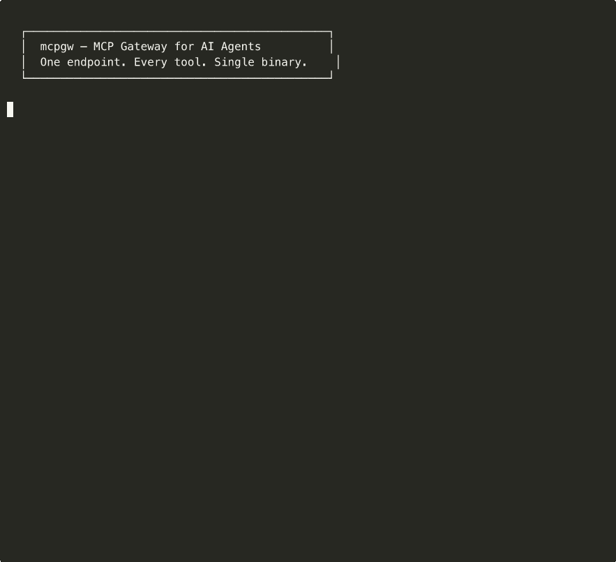

<div align="center">

# mcpgw

**One endpoint. Every AI tool. Single binary.**

[](https://github.com/pdaxt/mcpgw/actions/workflows/ci.yml)
[](LICENSE)
[](https://github.com/pdaxt/mcpgw)

**Connect Claude Code to one URL. Get access to 1,000+ tools from 20+ MCP backends.**

[Quick Start](#quick-start) · [How It Works](#how-it-works) · [Configuration](#configuration) · [REST API](#rest-api) · [Docs](docs/) · [Contributing](#contributing)



</div>

---

## The Problem

You have 20 MCP servers. Claude Code spawns all of them at startup — 20 child processes, 20 handshakes, half of them timeout. Your `~/.claude.json` is 500 lines of config. Adding a new MCP means editing JSON, restarting Claude Code, and praying nothing breaks.

## The Solution

`mcpgw` is a Rust gateway that spawns and manages all your MCP backends, exposing them through **one Streamable HTTP endpoint**. Claude Code connects to a single URL and gets every tool from every backend.

```
Before:  Claude Code → 20 stdio processes (fragile, slow startup, config hell)
After:   Claude Code → mcpgw (one HTTP URL) → 20 backends (managed, recoverable)
```

- **721 lines of Rust** — no runtime, no Docker, no dependencies
- **Concurrent startup** — all backends connect in parallel with 30s timeout each
- **Hot reconnect** — restart a crashed backend without restarting anything else
- **REST API** — call any MCP tool from scripts, webhooks, or other services
- **TOML config** — readable, diffable, no more JSON arrays

## Quick Start

```bash
# Build from source
git clone https://github.com/pdaxt/mcpgw.git
cd mcpgw
cargo install --path crates/mcp-gateway

# Create config
cat > mcpgw.toml << 'EOF'
[server]
host = "127.0.0.1"
port = 9090

[backends.search]
transport = "stdio"
command = "search-mcp"

[backends.secrets]
transport = "stdio"
command = "pqvault-unified"

[backends.remote-api]
transport = "http"
url = "http://remote-server:8080/mcp"
EOF

# Run
mcpgw mcpgw.toml
```

Point Claude Code at it:

```json
{
  "mcpServers": {
    "gateway": {
      "type": "http",
      "url": "http://localhost:9090/mcp"
    }
  }
}
```

That's it. One line replaces your entire MCP config.

## How It Works

```
Claude Code ──HTTP──▸ mcpgw (:9090/mcp)
                       │
                       ├── spawns ──▸ search-mcp (stdio)      12 tools
                       ├── spawns ──▸ pqvault (stdio)          14 tools
                       ├── spawns ──▸ crm-mcp (stdio)          35 tools
                       ├── spawns ──▸ email-mcp (stdio)        10 tools
                       ├── connects ▸ remote-api (HTTP)        50 tools
                       └── ...

                       All tools appear as one flat list.
                       Claude calls any tool → mcpgw routes to the right backend.
```

### Startup Sequence

1. **Load** `mcpgw.toml` — parse all backend configs
2. **Spawn** all stdio backends concurrently (30s timeout per backend)
3. **Discover** tools from each backend via MCP `list_tools`
4. **Serve** Streamable HTTP on `/mcp` + REST API on `/api/*`

One slow backend doesn't block the others. If a backend fails to connect, the rest still work.

### Tool Routing

When Claude calls a tool:
1. `mcpgw` searches all connected backends for the tool name
2. Routes the call to the correct backend
3. Returns the result

No prefixing, no namespacing — tools appear exactly as they do on the backend.

## Configuration

```toml
[server]
host = "127.0.0.1"    # Listen address
port = 9090            # Listen port
timeout_secs = 120     # Request timeout
api_key = "secret"     # Optional: require X-API-Key header on /api/*

# Stdio backend — mcpgw spawns and manages the process
[backends.search]
transport = "stdio"
command = "/usr/local/bin/search-mcp"
args = ["--cache-ttl", "3600"]
cwd = "/tmp"
[backends.search.env]
BRAVE_API_KEY = "your-key"

# HTTP backend — mcpgw connects to an already-running MCP server
[backends.remote]
transport = "http"
url = "http://10.0.0.5:8080/mcp"

# Webhook → tool call mapping
[webhooks.stripe_payment]
backend = "billing"
tool = "handle_payment"
```

## REST API

Beyond the MCP endpoint, `mcpgw` exposes a REST API for scripts and services:

| Method | Path | Description |
|--------|------|-------------|
| `GET` | `/health` | Backend status — connected count, degraded/healthy |
| `GET` | `/api/tools` | List all tools from all backends |
| `GET` | `/api/backends/{name}/tools` | List tools from one backend |
| `POST` | `/api/tools/call` | Call any tool (auto-routed) |
| `POST` | `/api/backends/{name}/tools/{tool}` | Call tool on specific backend |
| `POST` | `/api/backends/{name}/reconnect` | Hot-reconnect a backend |
| `POST` | `/api/webhooks/{hook}` | Webhook → tool call |

### Examples

```bash
# Health check
curl http://localhost:9090/health
# {"status":"healthy","backends_connected":20,"backends_configured":20}

# List all tools
curl http://localhost:9090/api/tools | jq '.count'
# 1458

# Call a tool
curl -X POST http://localhost:9090/api/tools/call \
  -H 'Content-Type: application/json' \
  -d '{"tool": "search", "arguments": {"query": "rust mcp server"}}'

# Reconnect a crashed backend
curl -X POST http://localhost:9090/api/backends/search/reconnect
# {"status":"reconnected","backend":"search"}
```

## Why Not...

| Alternative | Stars | Language | mcpgw Difference |
|-------------|-------|----------|------------------|
| [docker/mcp-gateway](https://github.com/docker/mcp-gateway) | 1.3K | Go | Docker plugin — requires Docker. mcpgw is standalone. |
| [microsoft/mcp-gateway](https://github.com/microsoft/mcp-gateway) | 514 | TypeScript | Enterprise auth/RBAC focus. mcpgw is minimal and fast. |
| [MCPJungle](https://github.com/mcpjungle/MCPJungle) | 896 | TypeScript | Node.js runtime. mcpgw is a single static binary. |
| [Unla](https://github.com/AmoyLab/Unla) | 2K | Go | Proxy-only (HTTP→HTTP). mcpgw **spawns** stdio backends. |

**mcpgw's unique value:** It manages the full lifecycle of stdio MCP servers — spawn, monitor, reconnect — not just proxy HTTP. Most MCP servers use stdio. mcpgw is the only Rust gateway that handles them natively.

## Architecture

```
crates/mcp-gateway/src/
├── main.rs         113 lines   Axum server + MCP Streamable HTTP
├── pool.rs         221 lines   Backend lifecycle (spawn, connect, reconnect)
├── config.rs       105 lines   TOML config parsing
├── proxy.rs         69 lines   MCP ServerHandler → routes to pool
├── routes.rs       159 lines   REST API endpoints
└── middleware.rs    55 lines   Auth + request logging
                    ─────────
                    721 lines total
```

Built on:
- [rmcp](https://github.com/anthropics/rust-mcp) — Official Rust MCP SDK (Streamable HTTP server + stdio client)
- [axum](https://github.com/tokio-rs/axum) — Rust web framework
- [tokio](https://github.com/tokio-rs/tokio) — Async runtime
- [dashmap](https://github.com/xacrimon/dashmap) — Concurrent HashMap for backend pool

## Roadmap

- [x] Stdio backend management (spawn, connect, reconnect)
- [x] HTTP backend support (connect to remote MCP servers)
- [x] Streamable HTTP MCP endpoint for Claude Code
- [x] REST API for scripts and webhooks
- [x] Concurrent startup with per-backend timeout
- [x] Hot reconnect without restart
- [ ] Dashboard UI (web-based backend monitoring)
- [ ] Tool-level metrics (latency, error rates, call counts)
- [ ] Config hot-reload (watch `mcpgw.toml` for changes)
- [ ] Backend health checks (periodic ping, auto-reconnect)
- [ ] Tool namespacing (optional `backend.tool` prefix to avoid collisions)
- [ ] SSE backend transport support

## Contributing

```bash
cargo test
cargo clippy -- -D warnings
cargo fmt --check
```

PRs welcome. The codebase is 721 lines — you can read the whole thing in 10 minutes.

## Documentation

| Doc | Description |
|-----|-------------|
| [Getting Started](docs/GETTING_STARTED.md) | Install, configure, and run in 2 minutes |
| [Configuration](docs/CONFIGURATION.md) | Full config reference with examples |
| [Architecture](docs/ARCHITECTURE.md) | How it works internally, design decisions |

## License

MIT
